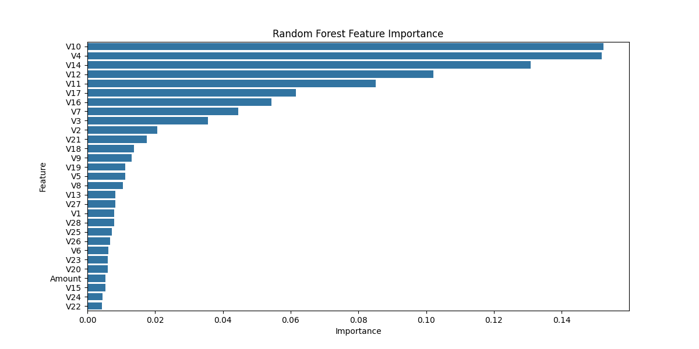
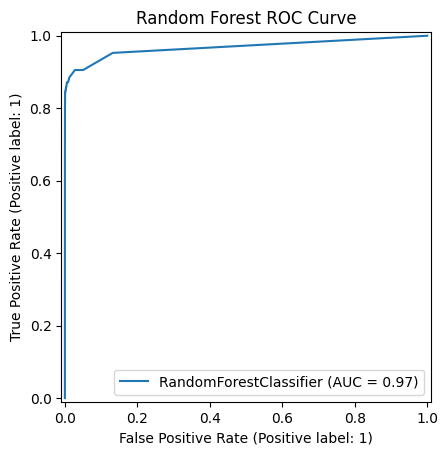

# Credit Card Fraud Detection

## Project Overview
This project focuses on detecting credit card fraud using machine learning models.  
It demonstrates handling **imbalanced datasets**, model comparison, evaluation metrics, and feature importance analysis.

---

## Dataset
The dataset used is the **Credit Card Fraud Detection dataset** from Kaggle:  
[https://www.kaggle.com/datasets/mlg-ulb/creditcardfraud](https://www.kaggle.com/datasets/mlg-ulb/creditcardfraud)

**Instructions:**  
1. Download the dataset from the link above.  
2. Place the CSV file in the `data/` folder as `creditcard.csv`.  

```python
import os
if not os.path.exists("data/creditcard.csv"):
    print("Please download the dataset from Kaggle and place it in the data folder.")

Methodology

Data Preprocessing

Dropped the Time column.

Scaled the Amount column using StandardScaler.

Split data into train and test sets (70/30) with stratification.

Handling Imbalanced Data

Applied SMOTE to balance the minority class in the training set.

Model Building

Trained three models:

Logistic Regression

Random Forest

XGBoost

Evaluation Metrics

Precision, Recall, F1-score

ROC-AUC score

Confusion Matrix

Feature Importance

Visualized which features contribute most to fraud prediction.

| Model               | Precision (Fraud) | Recall (Fraud) | F1-Score (Fraud) | ROC-AUC |
| ------------------- | ----------------- | -------------- | ---------------- | ------- |
| Logistic Regression | 0.06              | 0.88           | 0.12             | 0.968   |
| Random Forest       | 0.87              | 0.78           | 0.82             | 0.968   |
| XGBoost             | 0.24              | 0.84           | 0.38             | 0.967   |

Observation: Random Forest provided the best balance between precision and recall.

Visualization

Feature importance, confusion matrix, and ROC curve plots are saved in the images/ folder.

Example in README:

### Random Forest Feature Importance


### Confusion Matrix


### ROC Curve


How to Run

Clone the repository:

1.git clone https://github.com/hiteshkumarr20/credit-card-fraud-detection.git


2.Install required packages:

pip install -r requirements.txt


3.Download dataset and place it in data/creditcard.csv.

4.Open Jupyter Notebook:

jupyter notebook notebooks/credit_card_fraud.ipynb

5.Run cells sequentially.

Technologies & Libraries

Python, Jupyter Notebook

Pandas, NumPy

Scikit-learn

Imbalanced-learn (SMOTE)

Matplotlib, Seaborn

XGBoost

Author

Hitesh Kumar